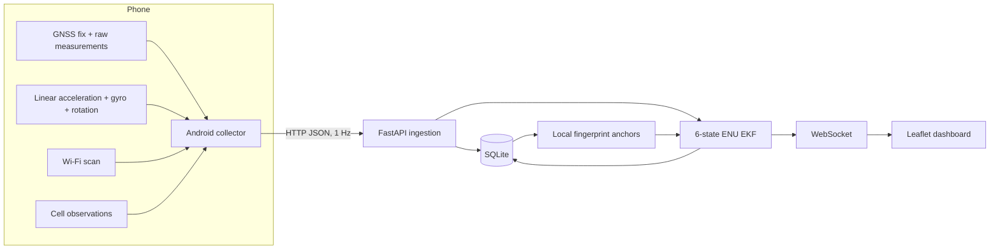

# Architecture

## State estimator

The baseline state is

`x = [east, north, up, v_east, v_north, v_up]`.

The Android client transforms linear acceleration into the Android world frame before transmission. In that frame X points east, Y points toward magnetic north and Z points upward. The backend uses the acceleration as the prediction input to a constant-acceleration EKF.

GNSS fixes provide absolute position updates. Their reported Android horizontal accuracy is used as the measurement standard deviation. When a fix is accurate enough, currently 15 m or better, visible Wi-Fi BSSIDs and cellular identifiers are associated with that location. During a later GNSS outage, known observations produce a coarse position update through a signal-weighted anchor centroid.

The local tangent-plane conversion uses an equirectangular ENU approximation. It is suitable for local experiments and city-scale traces, not long-distance navigation.

## Raw GNSS path

The collector records `GnssMeasurementsEvent` clock and measurement fields, including C/N0, pseudorange rate, accumulated delta range when available and carrier frequency when available. Version 0.1 stores these measurements but does not derive pseudorange or solve satellite states. A future raw-GNSS solver can be added behind the same telemetry schema.
